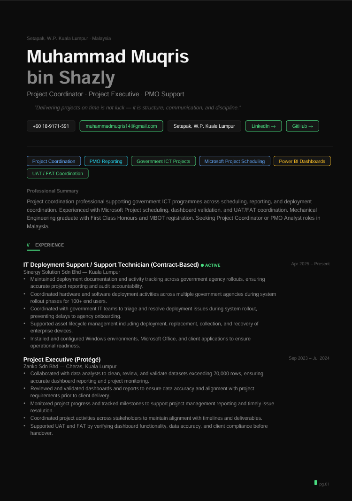

# Project Management Portfolio

This repository contains my project management portfolio highlighting experience in project coordination, PMO reporting, and dashboard tracking across government ICT projects.

**Portfolio PDF:** [Muqris_Portfolio.pdf](Muqris_Portfolio.pdf)  
**Preview:** 

**Supporting Artefacts (on separate repositories):**
- [PMO Dashboard – Power BI](https://github.com/muhammadmuqris14/pmo-dashboard-powerbi)
- [Project Scheduling – Microsoft Project](https://github.com/muhammadmuqris14/project-scheduling-msproject)
- [Project Task Tracker](https://github.com/muhammadmuqris14/project-task-tracker)
- [Weekly Status Report Template](https://github.com/muhammadmuqris14/pmo-status-report-template)
- [RAID Log Template](https://github.com/muhammadmuqris14/pmo-raid-log-template)
